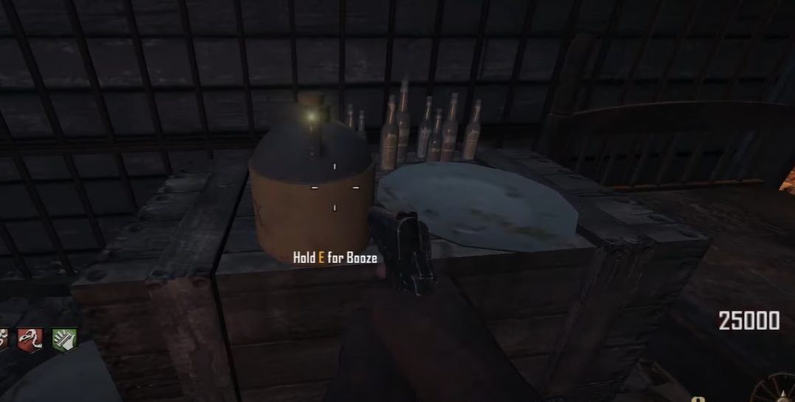
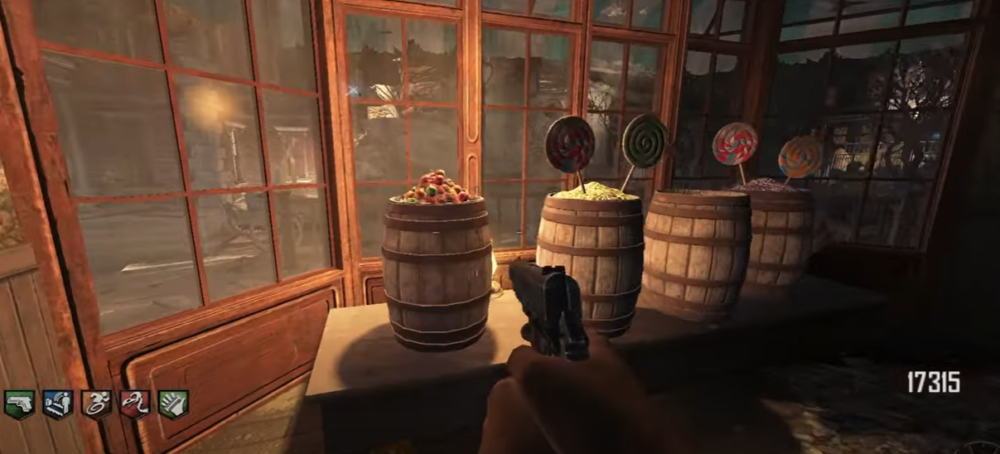

# Arthur Guide

## Keys
Arthur hides in his cell if shot. You must use the keys to set him free initially and every time he hides in his cell.

### Locations:
Next to his cell.\
\
\
Behind the bank counter.\
\
\
Upstairs in the saloon.\
\
\
In the courthouse.\

## Booze
Give booze to Arthur to have him turn around and smash anything in his way. This will open up areas of the map. Booze will spawn in once a round.

### Locations:
In the cell.\
\
\
On the corner of the saloon's bar.\
\
\
On this table in the saloon:\
\
\
On this table in the saloon:\
\
\
Purchase a bottle of booze for 1000 points on the bar in the saloon.\

## Candy
Candy can perform a variety of functions depending on when and where you give it to Arthur. Candy will spawn in once a round.

### Functions:
* Giving Arthur candy near a crawler will have him hold on to it for you
* Giving Arthur candy near a powerup will have him change it into a new one
* Giving Arthur candy near a chalk drawing will have him pick it up and draw it at a random location
* Giving Arthur candy near an empty box location will have him pick up the mystery box and put it there
* Giving Arthur candy near a box location will have him slam it in place for good
* Giving Arthur candy near an active box spin and he will re-spin the box
* Giving Arthur candy near an in-progress build table he will finish it for you
* Giving Arthur candy while free from all of these conditions will have him kill nearby zombies

### Locations:
By the display window.\
\
\
On this barrel:\
\
\
By the back door.\
\
\
Purchase candy for 1000 points at the register.\

