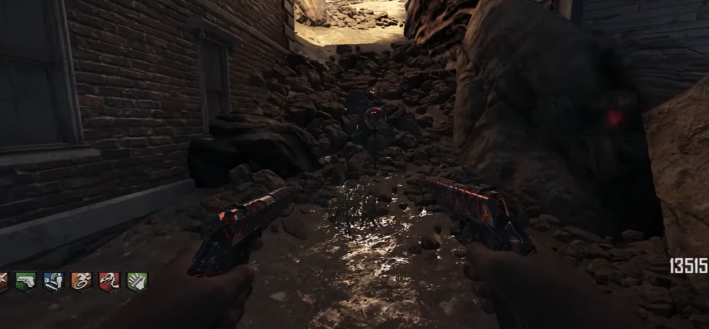
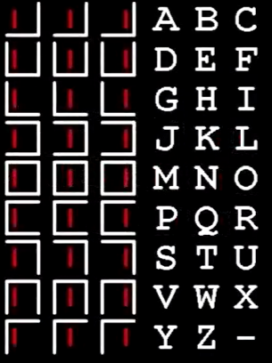
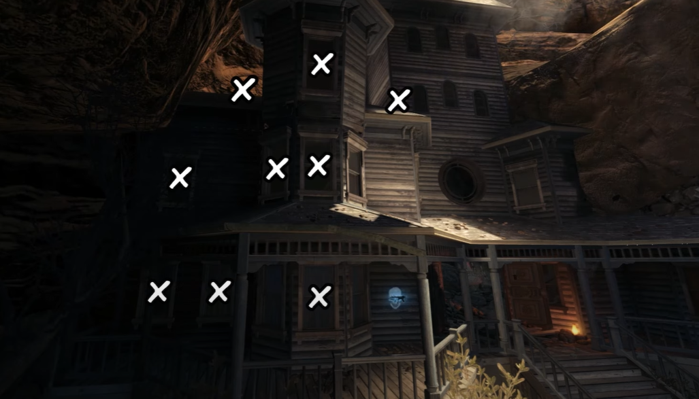
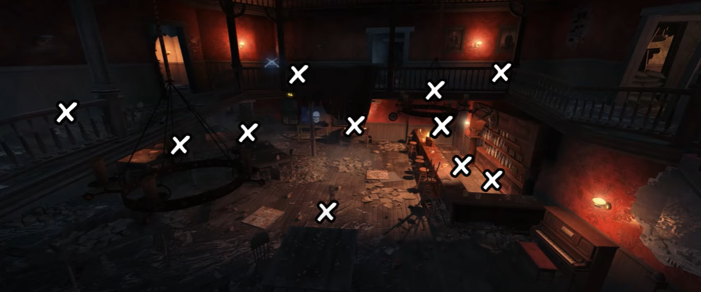

# Buried Maxis Main Quest Guide

## Note:
* Need four players
* Don't forget to do Navcard
* Need to build the Turbine
* Need to build the Subsurface Resonator

## Steps

### Step 1
Find the four parts to build outside the courthouse.

#### Part locations:
Next to the box location upstairs in the jailhouse.\
\
\
Hanging in the barn.\
\
\
In the corner of the gunsmith.\
\
\
Behind the podium in the church.\

### Step 2:
Find four orbs around the map and place down both the Turbine and Subsurface Resonator so that the orb is struck by the Resonator and destroyed.

#### Orb locations:
Up in the mines.\
\
\
Outside the saloon.\
\
\
Around the side of the church.\
\
\
Out the back of the mansion.\

### Step 3:
A lantern will appear floating in the air around the town. Throw a grenade at the lantern so that it blows the lantern up, and pick it up. Get Arthur to kill 10 zombies, and interact with the chalk drawing of the lantern on the gunsmith roof. A cipher will appear on the wall. Translate the cipher to three different phrases that can be found in the mineshaft.\
\
\
\
Place down a timebomb. Using the Bowie knife or Galvelknuckles, melee the three phrases in the correct order to spawn in a whisp, it will start moving towards the church. The wisp will fade away unless it passes through zombies. Once it makes it to its destination activate the timebomb and do this again.

### Step 4:
Go to the backside of the mansion and interact with the light board. This will have one of the bulbs turn yellow. Each bulb represents a bell somewhere on the map, players need to hit the bell according to which bulb is yellow. Once the bell has been hit the bulb will turn green and another will turn yellow. Do this until all bulbs are green.\
\

### Step 5:
Interact with the fountain in the courtyard to make a wish. This will start a sharpshooter trial where four sets of targets will spawn in that need to be shot each player needs to be ready to shoot their own targets. If a target is not shot the step will need to restart. If all players shoot all of their targets the step is complete.

#### Target locations:
Standing in front of the mansion.\
\
\
Standing on the second floor of the barn.\
\
\
Standing on the second floor of the saloon.\
\
\
Standing next to the fountain.\

### Step 6:
gg partner
