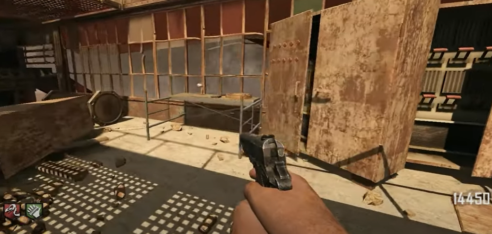
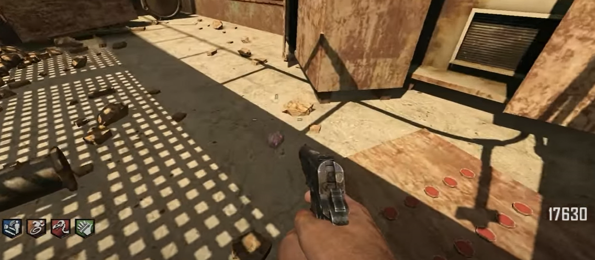
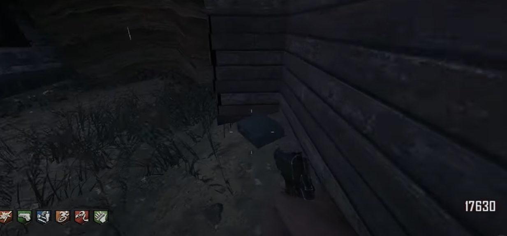
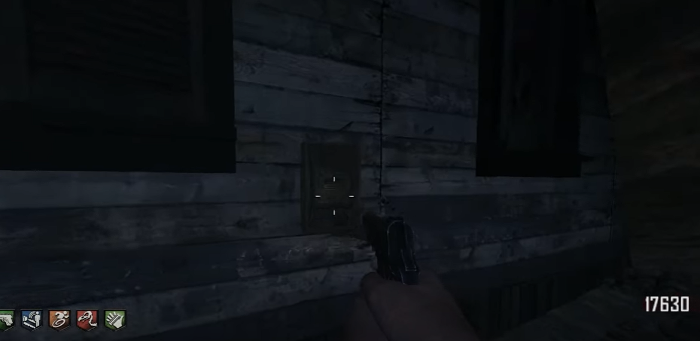
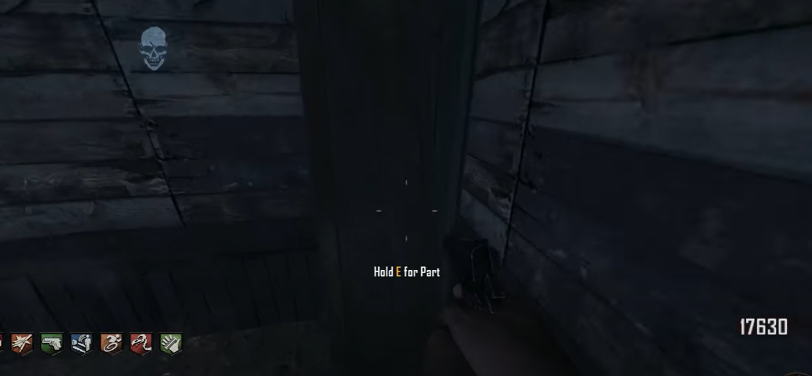
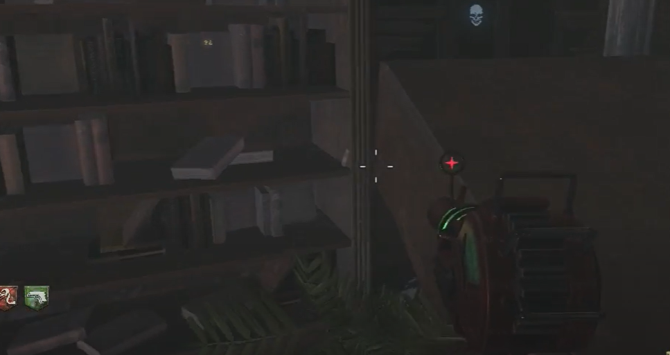

# Buried Navcard Guide
Use Navcard from Die Rise on the Navcard table in Buried. The card on this map is to be scanned on Tranzit. The table is built under spawn.\

## Navcard table part locations:
Under the spawn room.\
\
\
In the gunsmith alley:\
\
\
In the gunsmith alley:\
\
\
In the gunsmith alley:\

## Navcard location:
On this bookshelf in the underside of the mansion:\
\

