# Buried Richtofen Main Quest Guide

## Note:
* Need four players
* Don't forget to do Navcard
* Need the Paralyser

## Steps

### Step 1
Find the four parts to build outside the saloon.

#### Part locations:
Up in the mines.\
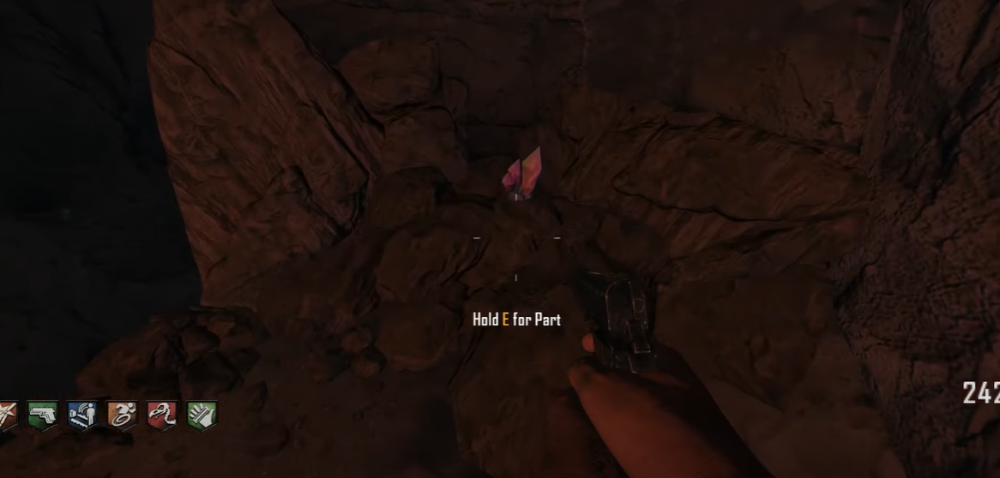\
\
Hanging in the barn.\
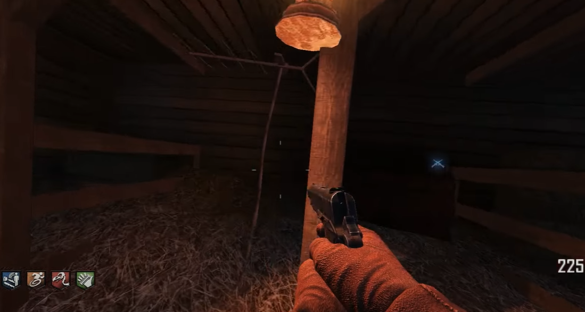\
\
In the corner of the gunsmith.\
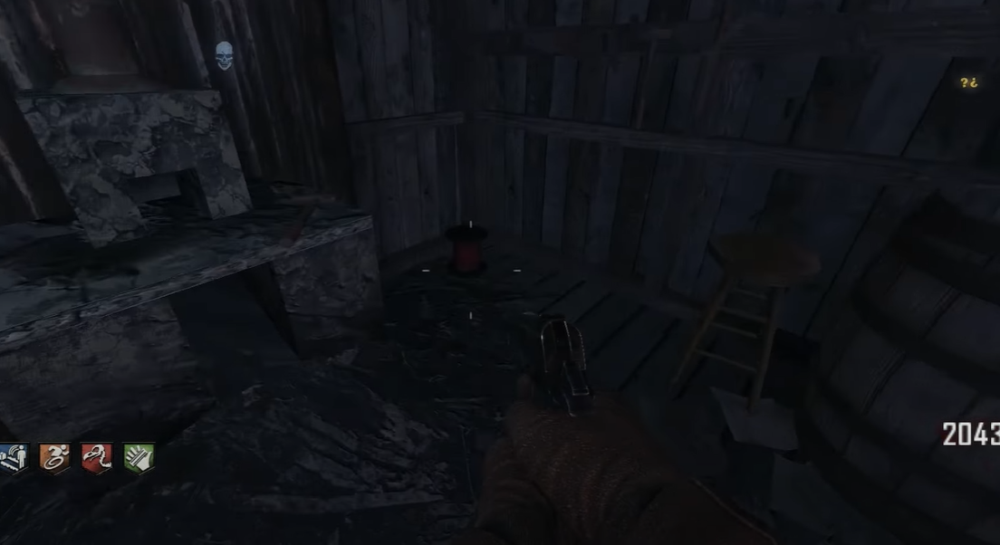\
\
On the balcony of the saloon.\
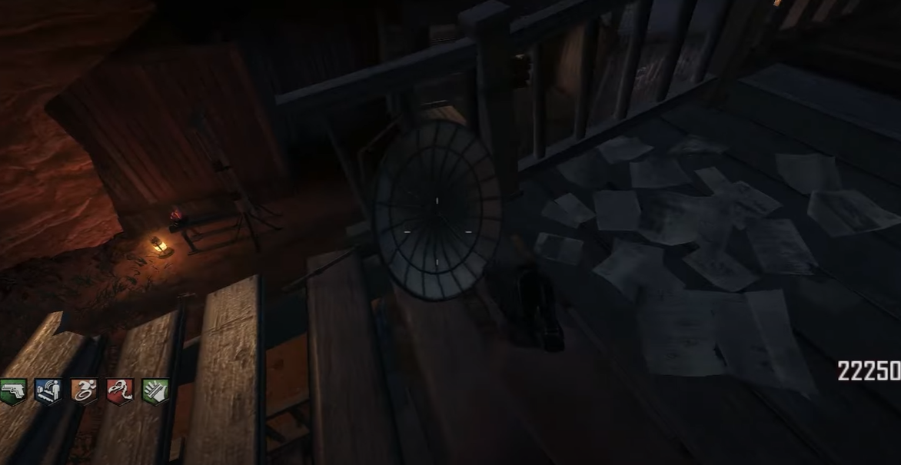

### Step 2:
Find four orbs around the map and charge them up with the Paralyser.

#### Orb locations:
Up in the mines.\
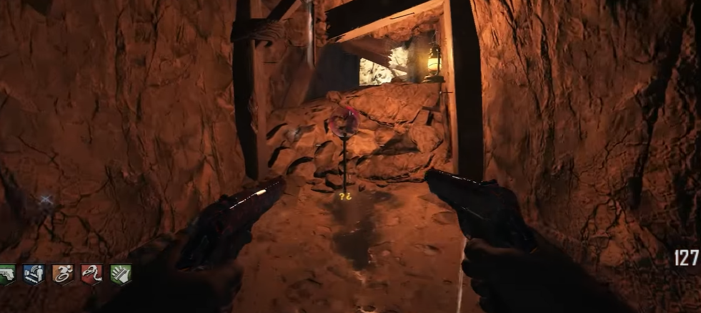\
\
Outside the saloon.\
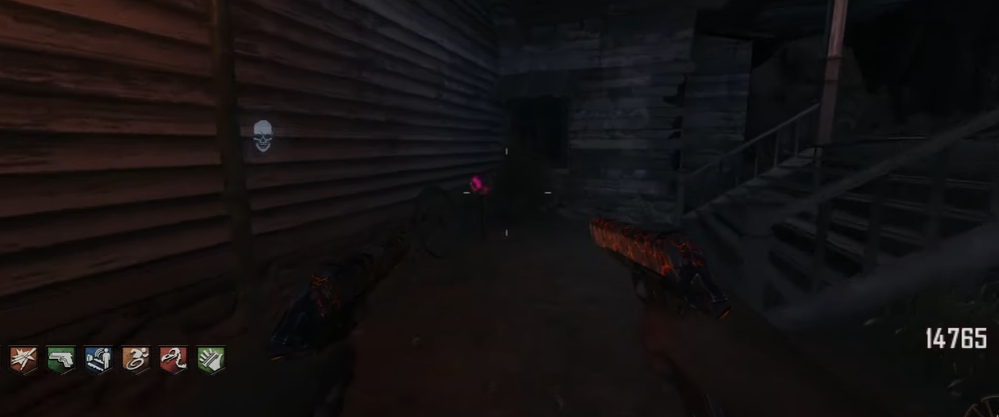\
\
Around the side of the church.\
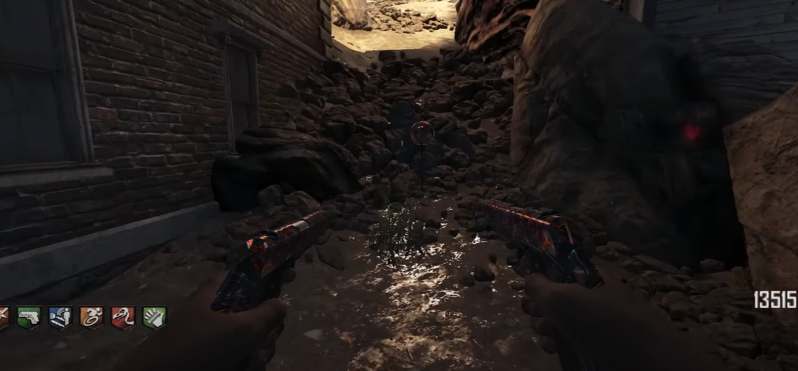\
\
Out the back of the mansion.\
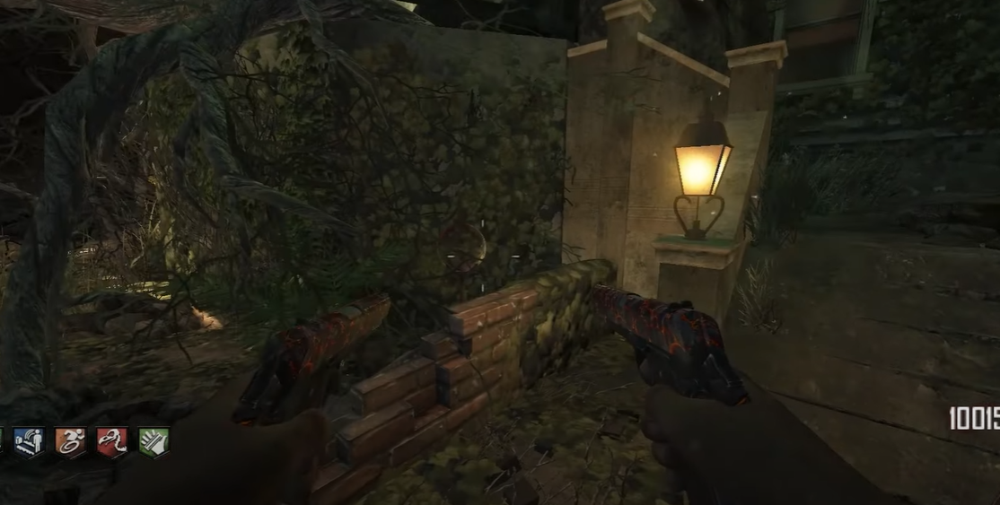

### Step 3:
A lantern will appear floating in the air around the town. Throw a grenade at the lantern so that it blows the lantern up, and pick it up. Kill 10 ghosts in the mansion, and interact with the chalk drawing of the lantern on the gunsmith roof. A cipher will appear on the wall. Translate the cipher to three different phrases that can be found in the mineshaft.\
\
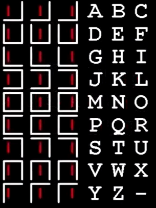\
\
Git vulture aid to see the whisp through the walls. Using the Bowie knife or Galvelknuckles, melee the three phrases in the correct order to spawn in a whisp, it will teleport around the map. The wisp will fade away unless you run into it. Once you run into it, the whips will teleport again until it makes it to its destination, run into it one last time.

### Step 4:
The whisp will now be attached to zombies nearby. Kill five zombies with the whisp attached to them, and throw the timebomb on the Guillotine. Have all players stand next to it and activate the timebomb. You will now be in round infinity, all zombies will have infinite health. Search bodies throughout the town until you find the switch. Once you have found the switch you will go back to the present time.

### Step 5:
There are going to be four switches at random locations in the maze. Each switch will need to be switched in a random order. You will know if the switch was flipped in its correct order if it sparks. You must flip all switches to reset the attempt. If the last switch flipped is the only one that sparked then the last switch flipped should always be that one and you need to find the proper order for the other three switches. Apply this logic to all possible outcomes including if two switches spark. The step is complete once all four switches are flipped in their appropriate sequence.

### Step 6:
Interact with the fountain in the courtyard to make a wish. This will start a sharpshooter trial where four sets of targets will spawn in that need to be shot each player needs to be ready to shoot their own targets. If a target is not shot the step will need to restart. If all players shoot all of their targets the step is complete.

#### Target locations:
Standing in front of the mansion.\
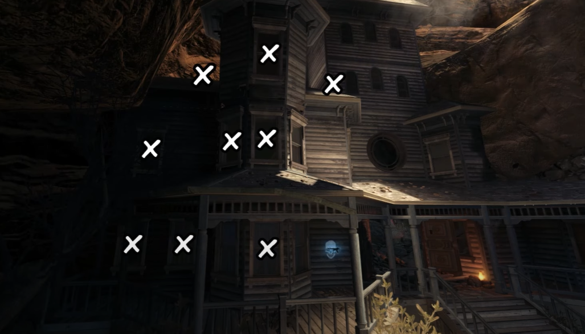\
\
Standing on the second floor of the barn.\
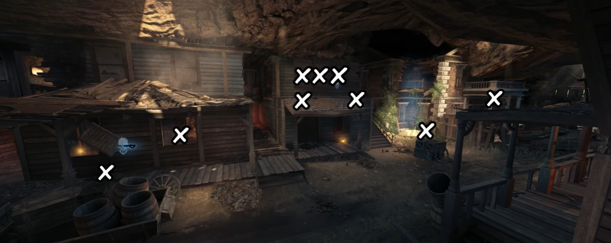\
\
Standing on the second floor of the saloon.\
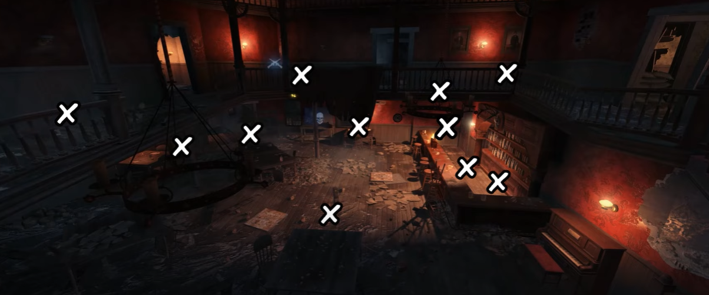\
\
Standing next to the fountain.\
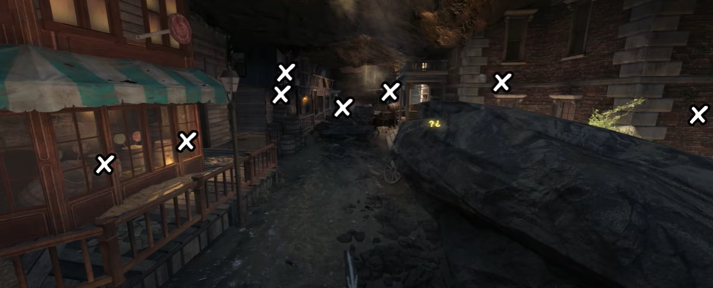

### Step 7:
gg partner
